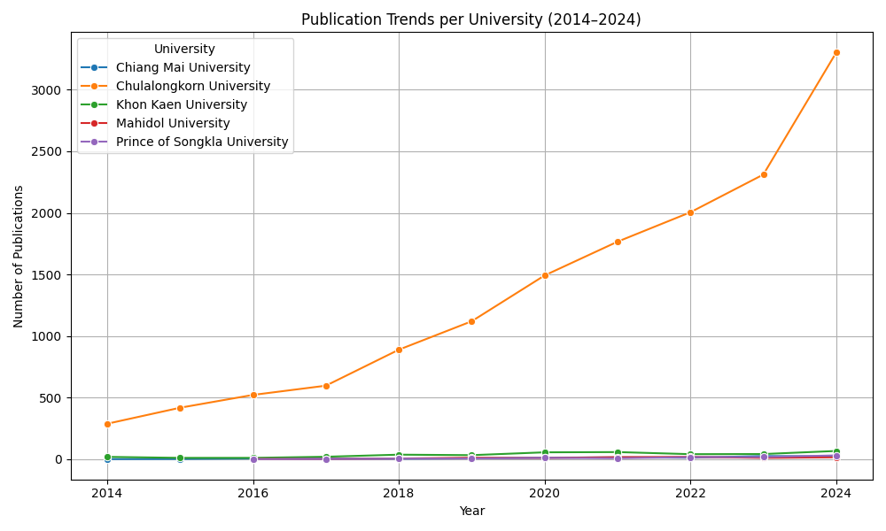
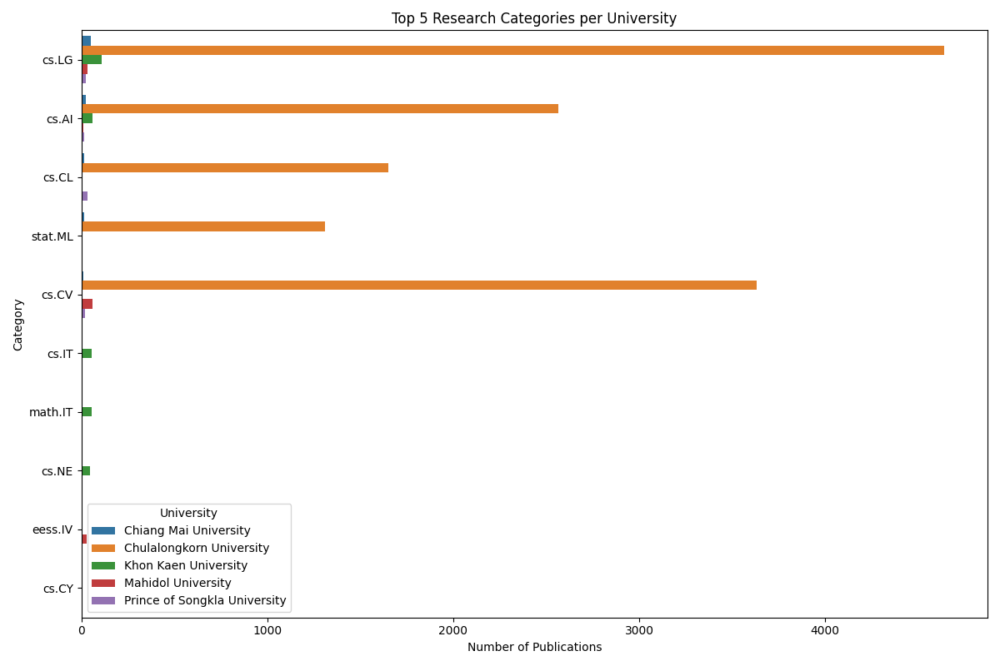

# โครงงาน: การวิเคราะห์ภูมิทัศน์งานวิจัยและการสร้างแบบจำลองทำนายศักยภาพผลงานวิจัยของมหาวิทยาลัยไทย

## การติดตั้งเบื้องต้น

ก่อนเริ่มต้น ให้ติดตั้งไลบรารีทั้งหมดที่ใช้ในโครงการด้วยคำสั่งต่อไปนี้ (ใน Terminal):

```bash
pip3 install -r requirements.txt
```

จากนั้นให้เปลี่ยน directory ไปที่โฟลเดอร์ `src/`  
```bash
cd src/
```

---

## ส่วนที่ 1: การวิเคราะห์ภูมิทัศน์งานวิจัยเชิงเปรียบเทียบ (50 คะแนน)

### ขั้นตอนที่ 1 (20 คะแนน)
**วัตถุประสงค์:**  
ระบุและสกัดข้อมูลของแต่ละมหาวิทยาลัยจากข้อมูลที่ไม่สมบูรณ์ พร้อมแสดงแนวทางในการจัดการข้อมูล

**คำสั่งรัน:**
```bash
python3 clean_data.py
python3 map_university.py
```

**ผลลัพธ์:**  
ไฟล์ผลลัพธ์จะถูกเก็บในโฟลเดอร์  
```
outputs/
```
เช่น  
- outputs/arxiv_cs_filtered.csv  
- outputs/arxiv_cs_university.csv

---

### ▶️ ขั้นตอนที่ 2 (30 คะแนน)
**วัตถุประสงค์:**  
ทำการวิเคราะห์เชิงลึกและนำเสนอข้อมูลเปรียบเทียบมหาวิทยาลัย พร้อมสร้าง Data Visualization

**คำสั่งรัน:**
```bash
python3 eda_analysis.py
```

**ค่าพารามิเตอร์ในไฟล์:**  
```python
INPUT_FILE = "outputs/arxiv_cs_university.csv"
OUTPUT_DIR = "eda_results"
```

**ผลลัพธ์:**  
กราฟและตารางสรุปจะอยู่ในโฟลเดอร์
```
eda_results/
```
เช่น  
- publication_trends.png  
- top_categories.png  
- coauthorship_network.png

🖼️ **ตัวอย่างภาพ Visualization:**  
### -ปริมาณผลงาน


### -สาขาที่โดดเด่น


### -เครือข่ายควำมร่วมมือ

---

## 🔹 ส่วนที่ 2: การสร้างแบบจำลองทำนายศักยภาพ (50 คะแนน)

### ▶️ ขั้นตอนที่ 3 (15 คะแนน)
**วัตถุประสงค์:**  
สร้างตัวแปรเป้าหมาย (Target Variable) และฟีเจอร์สำหรับโมเดล เพื่อสะท้อนศักยภาพของงานวิจัยแต่ละชิ้น

**คำสั่งรัน:**
```bash
python3 cited_by_count.py
```

**ผลลัพธ์:**  
ไฟล์พร้อมสำหรับการเรียนรู้โมเดลจะอยู่ที่  
```
outputs/arxiv_for_model.csv
```

---

### ▶️ ขั้นตอนที่ 4 (15 คะแนน)
**วัตถุประสงค์:**  
สร้างแบบจำลองพื้นฐาน (Baseline Model) เพื่อใช้เป็นเกณฑ์มาตรฐานเปรียบเทียบ

**คำสั่งรัน:**
```bash
python3 baseline_model.py
```

**ผลลัพธ์:**  
- รายงานผลลัพธ์ในไฟล์  
  ```
  outputs/baseline_results.json
  ```

---

### ▶️ ขั้นตอนที่ 5 (20 คะแนน)
**วัตถุประสงค์:**  
ใช้เทคนิค NLP (TF-IDF + LightGBM) เพื่อพัฒนาโมเดลขั้นสูง  
และประเมินการเพิ่มประสิทธิภาพเมื่อเทียบกับโมเดลพื้นฐาน

**คำสั่งรัน:**
```bash
python3 tfidf_lightgbm.py
```

**ผลลัพธ์:**  
- ไฟล์โมเดลและรายงานผลลัพธ์จะถูกบันทึกไว้ใน  
  ```
  outputs/
  ```
- สามารถนำผลลัพธ์ไปเปรียบเทียบความแม่นยำกับ Baseline Model ได้โดยตรง

---

## สรุปโครงสร้างไฟล์หลัก

```
POC_PSU/
│
├── requirements.txt
├── src/
│   ├── clean_data.py
│   ├── map_university.py
│   ├── eda_analysis.py
│   ├── prepare_target_and_features.py
│   ├── baseline_model.py
│   ├── tfidf_lightgbm.py
│   ├── outputs/
│   └── eda_results/
│
└── README.md
```

---

## หมายเหตุเพิ่มเติม
- แนะนำให้รันแต่ละไฟล์ตามลำดับเพื่อให้ได้ข้อมูลครบทุกขั้นตอน  
- หากต้องการปรับพารามิเตอร์ เช่น ปี, หมวดหมู่, หรือเส้นทางไฟล์ สามารถแก้ได้ในแต่ละสคริปต์โดยตรง  
- โปรเจกต์นี้ออกแบบให้สามารถขยายผลต่อยอด เช่น การเพิ่มข้อมูลปีใหม่ หรือขยายกลุ่มมหาวิทยาลัยอื่น ๆ ได้ง่าย
